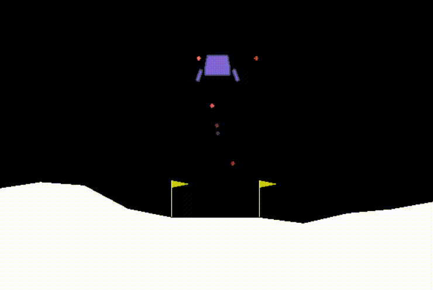

# Deep-Q-Learning-Agents
Implementing Q-Learning agents using Deep Neural Networks for the OpenAI Gym environments. The current example is based on the LunarLander-v2 environment. The evolution of reinforcement learning and the effect of DQN improvement techniques on the performance of the agent can be observed from this example.

## Getting Started

These instructions will get you a copy of the project up and running on your local machine for development and testing purposes: <br/>
1. Clone the project with link: https://github.com/Srikanth-Kb/Q-Learning-Agents.git

### Prerequisites

```
OpenAi - Gym
PyTorch - Deep learning framework
Numpy library
Jupyter notebook / VS Code Python Extension
```

### Working principle

There are three major components in any RL Framework:

1. <b>Model</b>: Represents the Neural Network Architecture, in this case, Q-Network and Dueling-Q-Network<br />
2. <b>Agent</b>: Represents the RL agent, that learns, acts, saves experiences by interacting with the environment.<br />
3. <b>Environment</b>: Represents the space where the agent interacts and performs actions to earn rewards.<br />

### DQN Improvements
Three major improvements for the DQN architecture are implemented in this repository:
1. <b>Double Q Network</b>
2. <b>Dueling Q Network</b>
3. <b>Dueling Double Q Network</b>

## Running the Code

Run the following file for training the RL from scratch for each of the architectures: Comparison_Of_DQNs.ipynb



## ToDo
1. Fix plt.savefig issue <br/>
2. Automate training for Dueling network architecture <br/>